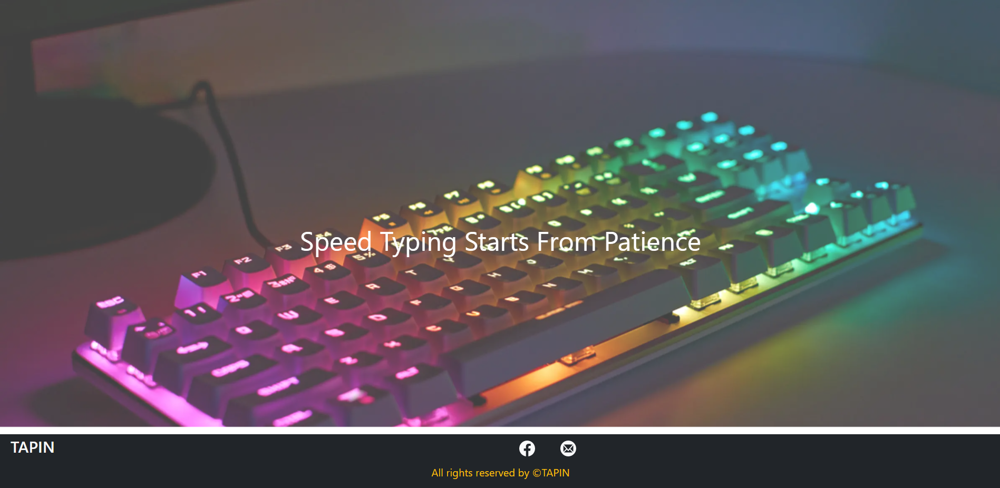
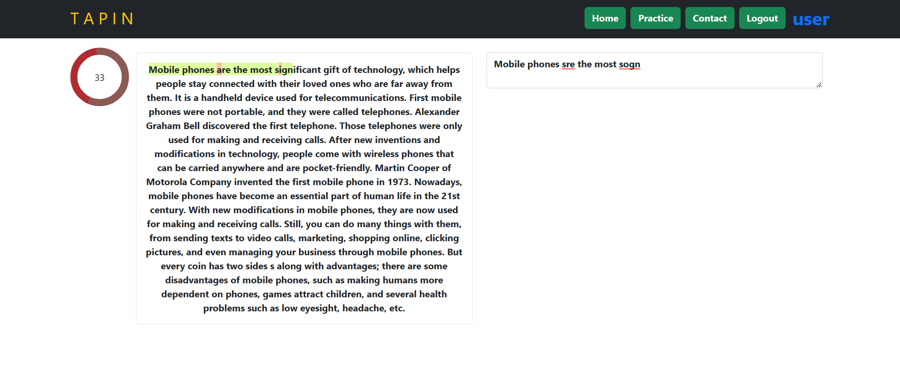

# TAPIN 


### Built with 

<p align="center">
    
</p>

- Frontend:  [React](https://react.dev/), [Firebase-Auth](https://firebase.google.com/docs/auth), [React-Bootstrap](https://react-bootstrap.github.io/), [Axios](https://axios-http.com/docs/intro) & [React-Icons](https://react-icons.github.io/react-icons/)
- Backend: [Node](https://nodejs.org/en), [Express](https://expressjs.com/) & [Mongoose](https://mongoosejs.com/), [JWT](https://jwt.io/)

## Demo
<p align="center"> 
  <b> <a href="https://tapin-amber.vercel.app/"> Live_Link </a>&nbsp; &nbsp; &nbsp;| &nbsp; &nbsp; &nbsp;<a href="https://github.com/Mohammad-Ashikul-Islam/Typing_Speed_Test-Back-End-"> Backend_Code </a> </b>
</p>

<p align="center">
    <br>
    
    <br>
    
    <br>
</p>


## Features

- Create account or Login as a User
- Join one minute typing speed test and a random passage from backend will apprear to user
- Watch result after test in WPM(Word Per Minute), CPM(Character Per Minute) & Accuracy
- Appeared random passage is actually selected from some predefined passages in backend API
- Login as an admin
- Admin can add new passage in backend API which might appear as a random passage in test to user

## Build Setup

**Frontend Server**

``` bash
# install dependencies
npm install 

# start server
npm start

# build for production 
npm run build

# serve in production mode 
npm run preview

```

**Backend Server**

``` bash
# install dependencies
npm install 

# start server
npm start

# start in development mode
npm run dev

```

## Deployment
- Frontend: [Vercel](https://vercel.com/)
- Backend: [Cyclic](https://www.cyclic.sh/)

> Due to [Vercel](https://render.com) and [Cyclic's](https://www.cyclic.sh/) internal system of free tier, first request on app or backend API may take longer time than the usual, even upto a minute. So, please consider the issue and wait till the Cyclic/Vercel server wakes up or reload in case of the first front-end connection freezing/backend connection freezing happens. Thank you
